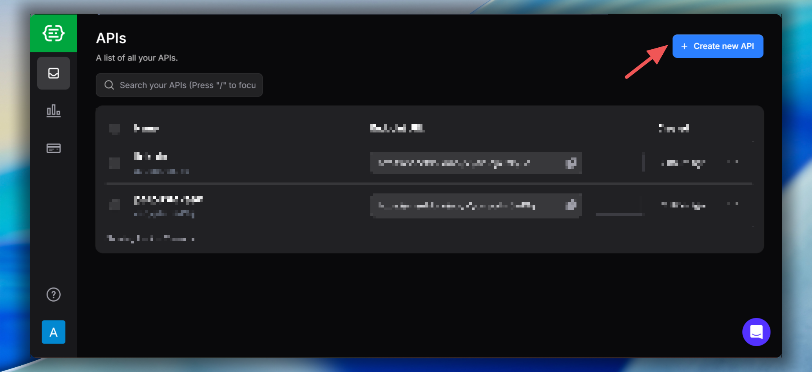
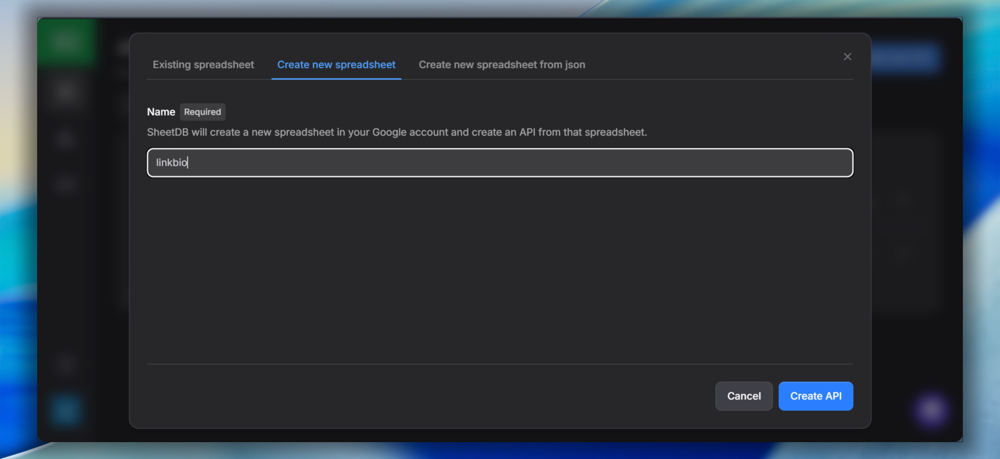
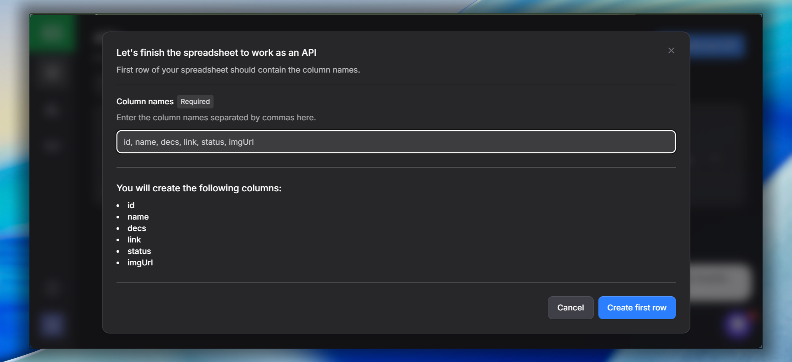
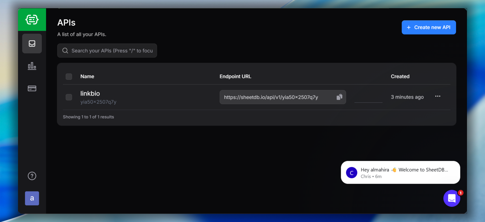
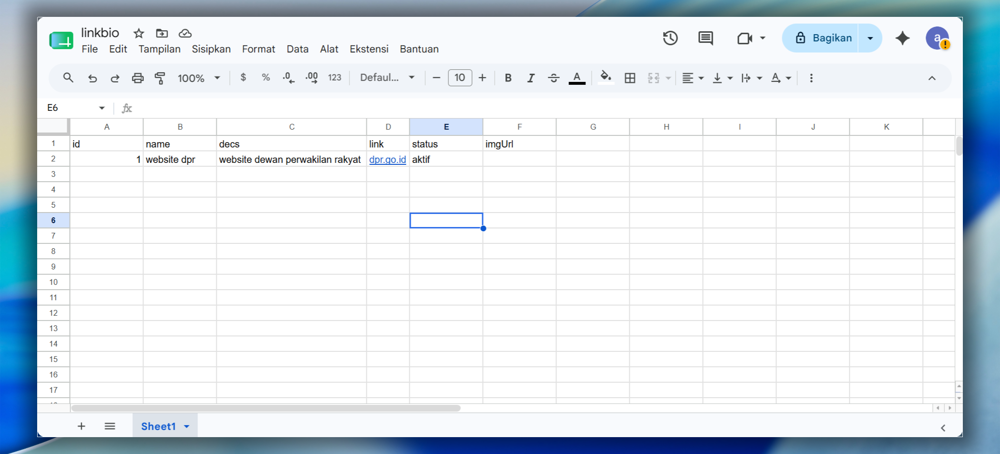

# Link Bio

Personal link bio page dengan style Neo Brutalism dark mode.  
Data link diambil dari Google Sheets via SheetDB, terintegrasi feed YouTube & Medium.

---

## Setup SheetDB

### 1. Buat API baru

- Masuk ke [sheetdb.io](https://sheetdb.io/)
- Klik tombol **Create new API**



### 2. Buat spreadsheet baru

- Klik **Create new spreadsheet**
- Isi nama spreadsheet, misal `linkbio`
- Klik **Create API**



### 3. Isi kolom spreadsheet

- Isikan kolom: `id`, `name`, `decs`, `link`, `status`, `imgUrl`
- Klik **Create first row**



### 4. Clone repository

```bash
git clone https://github.com/Rifaldo-dev/bio
cd bio
```

### 5. Salin Endpoint URL

- Buka dashboard [sheetdb.io](https://sheetdb.io/) kembali
- Salin **Endpoint URL**



### 6. Ubah Endpoint URL

- Buka file `src/js/links.js`
- Ubah `const API_URL` di baris 1 dengan Endpoint URL yang sudah disalin

```js
const API_URL = 'https://sheetdb.io/api/v1/xxxxx'; // ganti dengan URL kamu
```

### 7. Isi data di Google Spreadsheet

- Buka Google Spreadsheet yang terhubung
- Isi data sesuai kolom yang sudah dibuat

| id | name | decs | link | status | imgUrl |
|----|------|------|------|--------|--------|
| 1  | Nama Project | Deskripsi singkat | https://... | aktif | (opsional) |

- `status` → isi `aktif` supaya tampil di halaman
- `imgUrl` → opsional, bisa diisi link gambar dari hosting gratis (Imgur, ImgBB, dll)



---

## Konfigurasi Lainnya

**YouTube** — edit `src/js/youtube.js`:
```js
const YOUTUBE_FEED = 'https://www.youtube.com/feeds/videos.xml?channel_id=UCxxxxx';
```

**Medium** — edit `src/js/medium.js`:
```js
const MEDIUM_USERNAME = '@username';
```

---

## Cara Jalankan

Buka `index.html` di browser, atau pakai live server:

```bash
npx serve .
```

---

## Cara Tambah Link Baru

Tambah row baru di Google Spreadsheet → halaman otomatis update tanpa edit kode.
